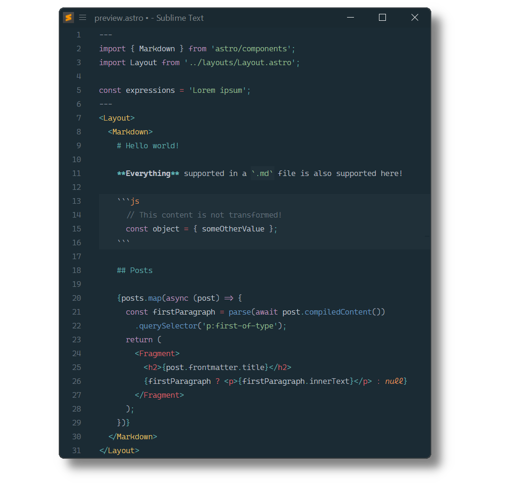

Astro
=====

[Astro](https://astro.build) syntax definitions for [Sublime Text](https://www.sublimetext.com) based on its HTML, Markdown and JSX syntaxes.

## Installation

### Package Control

The easiest way to install is using [Package Control](https://packagecontrol.io). It's listed as `Astro`.

1. Open `Command Palette` using <kbd>ctrl+shift+P</kbd> or menu item `Tools → Command Palette...`
2. Choose `Package Control: Install Package`
3. Find `Astro` and hit <kbd>Enter</kbd>

### Manual Install

1. Download appropriate [Astro-2.0.0-st4xxx.sublime-package](https://github.com/SublimeText/Astro/releases) for your Sublime Text build.
   _The `st4xxx` suffix denotes the least required ST build for the sublime-package to work._
2. Rename it to _Astro.sublime-package_
3. Copy it into _Installed Packages_ directory

> To find _Installed Packages_...
>
> 1. call _Menu > Preferences > Browse Packages.._
> 2. Navigate to parent folder

## Requirements

- Astro 2.0.0 requires Sublime Text 4126+
- Syntax highlighting in `<style>` tags is powered by 3rd-party packages
  - [LESS](https://packagecontrol.io/packages/LESS)
  - [Sass](https://packagecontrol.io/packages/Sass)
  - [Stylus](https://packagecontrol.io/packages/Stylus)
- Intellisense features are provided by [LSP](https://packagecontrol.io/packages/LSP) and [LSP-astro](https://packagecontrol.io/packages/LSP-astro).

## Troubleshooting

### §1 Syntax Definition Parse Errors

Astro extends Sublime Text's HTML and Markdown syntax definitions.

If Astro syntax highlighting doesn't work and console displays syntax errors in _HTML (Astro).sublime-syntax_ or _Markdown (Astro).sublime-syntax_, please make sure to remove any out-dated syntax override.

Steps:

1. call _Menu > Preferences > Browse Packages.._
2. Look for _HTML_ and _Markdown_ folders
3. Remove them or at least delete any syntax definition in them.

### §2 Frontmatter or Components are not highlighted

Astro includes TypeScript (`source.ts`) and TSX (`source.tsx`) syntaxes to render Components.

Make sure to remove out-dated TypeScript or TSX syntax packages, which don't meet least compatibility requirements.

They can be identified by calling `sublime.find_syntax_by_scope("source.ts")` in ST's console.

Known candidates are:

- [TypeScript](https://packagecontrol.io/packages/TypeScript)
- [TypeScript Syntax](https://packagecontrol.io/packages/TypeScript%20Syntax)
